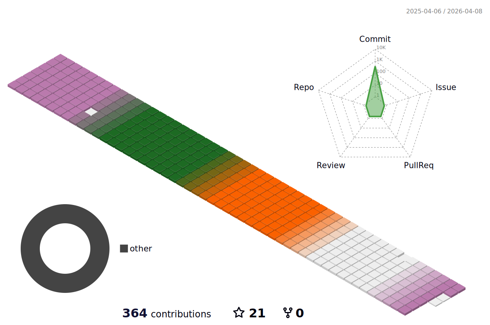

 

### 👋 Hi there 👋

- 🌱 I’m mainly using 
 and 
 languages.

 

- I've belonged to ~
  - 🦁LIKELION Univ. 12th BE -2024
  - 🟡Kakao Tech Campus 2nd BE -2024
  - 🔵CNU SW Academy 2nd BE - 2023

 

- 24_summer ☀️
  - ✏️**Study**     Spring Boot  /  Functional Programming  / Stream
  - 💻**Clone Coding**   Kakao Shopping Site
  - 🧑‍🤝‍🧑**Team Project**   Hackathon (2) - Running App based on gamification
- 24_spring 💮
  - ✏️**Study**    Java / Python for Coding-Test
  - 🧑‍🤝‍🧑**Team Project** Ideathon - Running App based on gamification

 

- 🌬️ I've work for a service based on 

- ⚡ This is my coding blog !! 
  https://popo-coding.tistory.com/

  
  
 

<h2>🏅Certificates🏅 </h2>

### 🥸Achieved

- ✅ **SQLD** (24.06.21.)
- ✅ **ADsP** (24.06.07.)
- ✅ **Engineer Information Processing** (23.11.15.)
- ✅ **Topcit Lv.3** (23.10.28.)
    - Score :460 / 1000
- ✅ **Azure AI Fundamentals** (22.12.30.)
- ✅ **COS Lv.1** (18.06.08.)
    - Coding Specialist / Advanced (Scratch, Korean)
      
### 😵‍💫Preparing...
- ☑ ADP (~ing)
- ☑ SQLP (~ing)

 

<h2>🏆Awards🏆 </h2>

- 🥇 (24)
- 🥇 (24)

- 🥉 (23)
- 🥉 (23)
- 🥉 (23)
- 🎖️ (23)

 

<h2>🍼Stacks🍼 </h2>

😎 Since 2022 ~  I've tried  ... 
 (not much experienced on it yet😅)

### ✔️Cloud

 
  
   
   
   
   
   
  
### ✔️Container
   
   

  

### ✔️Database 

 
  
   
   
  
    

  

### ✔️Back-end

 
  
   
  
 
   

   
  
  

   

   

   
  
  
  
  

### ✔️Frond-end

  
   
   
   
  
     

  
  

   

  

 

<h2> 🐣 Contributions 🐣 </h2>

<!--
**Shsin9797/Shsin9797** is a ✨ _special_ ✨ repository because its `README.md` (this file) appears on your GitHub profile.

Here are some ideas to get you started:

- 🔭 I’m currently working on
- 👯 I’m looking to collaborate on ...
- 🤔 I’m looking for help with ...
- 💬 Ask me about ...
- 📫 How to reach me: ...
- 😄 Pronouns: ... 
- ⚡ Fun fact: ...
-->

