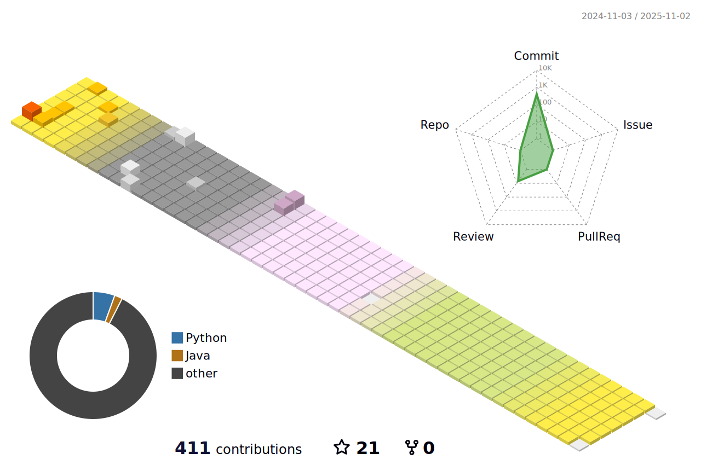

 aa

### 👋 Hi there 👋

- 🌱 I’m mainly learning python and java.

  

- 🌬️ I work for a service based on kubernetes.
- ⚡ This is my coding blog !! 
  https://popo-coding.tistory.com/

 

<h2>ğŸ¼Stacks🼠</h2>

😎 I've tried  ... 
 (not much experienced on it yet😅)

### ✔️Cloud

 
  
   
   
   
   
   
  
### ✔️Container
   
   

  

### ✔️Database 

 
  
   
   
  
    

  

### ✔️Back-end

 
  
   
  
 
   

   
  
  

   

   

   
  
  
  
  

### ✔️Frond-end

  
   
   
   
  
     

  
  

   

  

 

<h2> 🣠Contributions 🣠</h2>

<!--
**Shsin9797/Shsin9797** is a ✨ _special_ ✨ repository because its `README.md` (this file) appears on your GitHub profile.

Here are some ideas to get you started:

- 🔭 I’m currently working on
- 👯 I’m looking to collaborate on ...
- 🤔 I’m looking for help with ...
- 💬 Ask me about ...
- 📫 How to reach me: ...
- 😄 Pronouns: ... 
- ⚡ Fun fact: ...
-->

